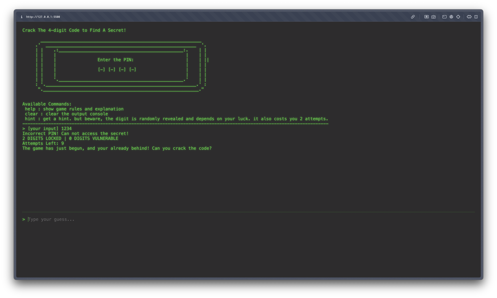

# EncryPin

A text-only code guessing game made in retro terminal-style ui

**Objective of the Game**: crack a 4-digit PIN in under 10 attempts to uncover a grand secret
**How to Play**: type your guess in the field provided or use help function to get detailed explanantion

**PLAY HERE**: [https://strawberryskeleton.github.io/encrypin/](https://strawberryskeleton.github.io/encrypin/)

## Features
- a separate output box which shows latest output
- terminal-like functions (help/hint/clear)
- typing animation
- beeping sounds for different purposes
- crt screen + terminal style ui with ascii art
- randomly generated secret pin
- custom messages for each number of attempts left

## Screenshots

## Credits
- made by me
- console art: [https://www.asciiart.eu/art/24043b4588d6697f]
- AI USAGE: beeeping sound logic + typing animation logic
- did not use any AI to generate ascii art or text messages. all text messages are written by me
- my elder sister for suggesting the name